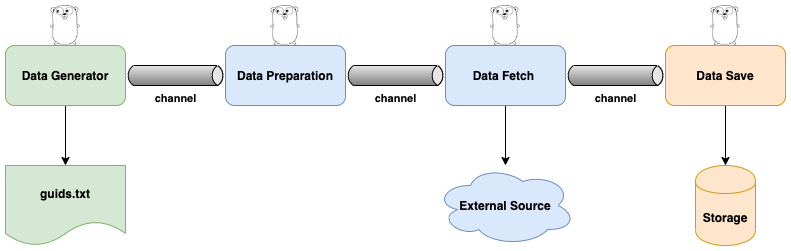

## Ejemplo de arquitecura pipeline en golang (concurrency)
### Branches

* main
    * contiene ejemplo de procesamiento de imagenes
* feature/4-stages
  * contiene ejemplo de pipeline con de 4 stages
* feature/pipeline-expensive-routine
  * contiene ejemplo de pipelines implementando fan-in/fan-out

